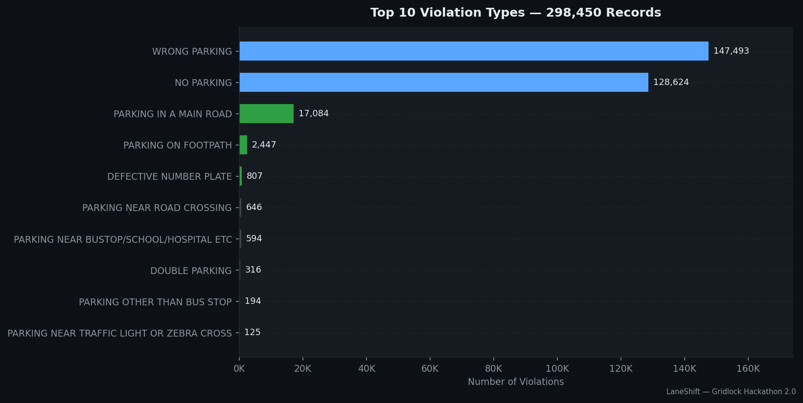
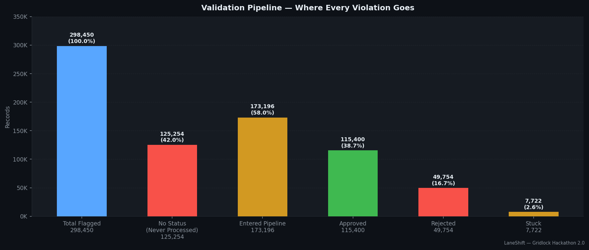
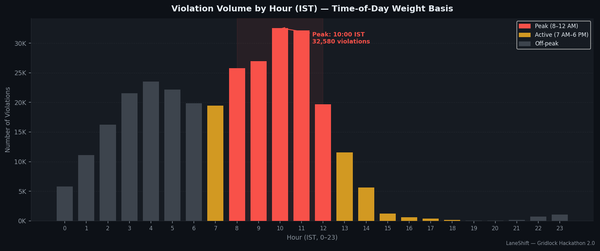
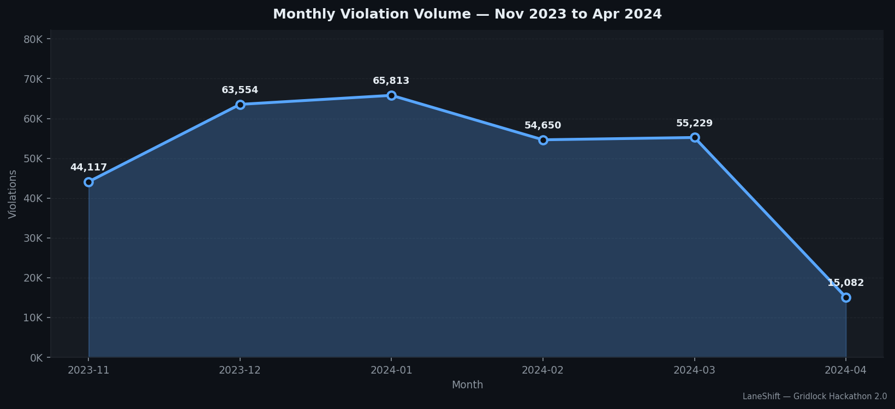
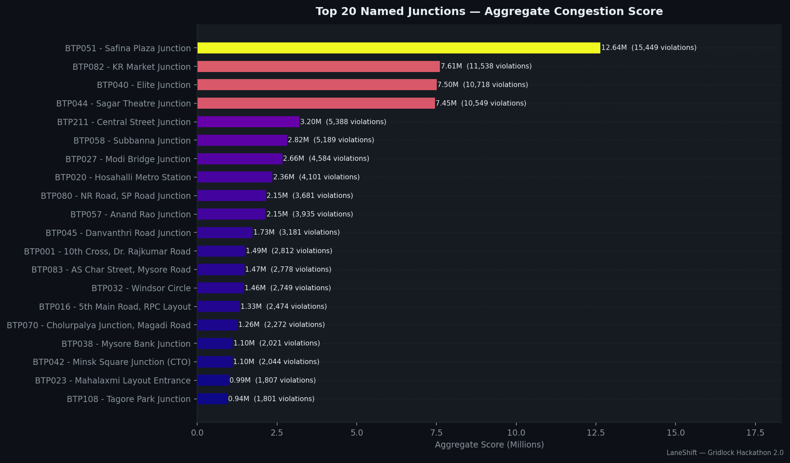
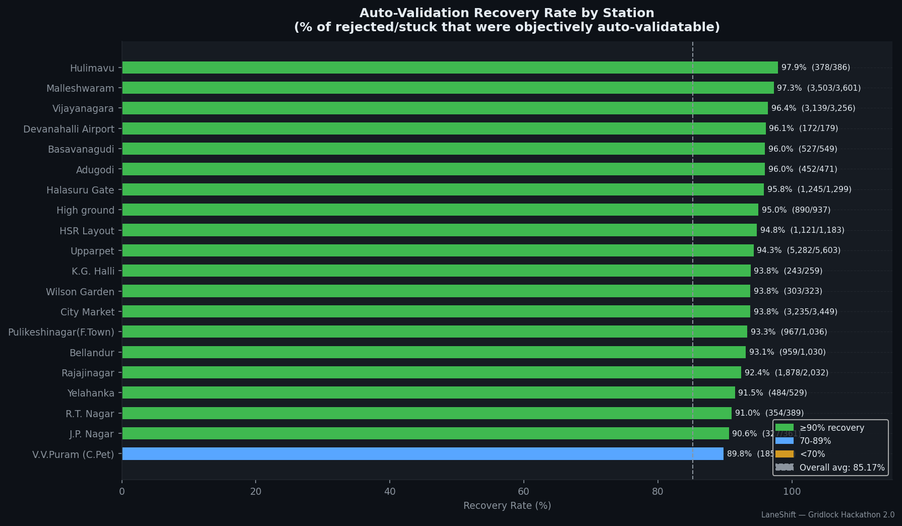
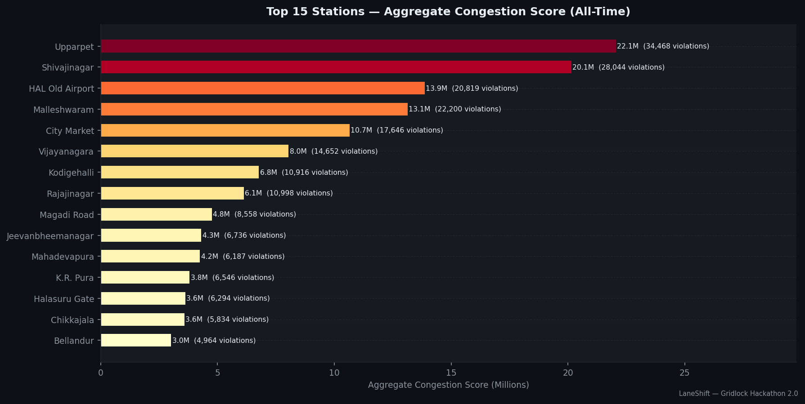
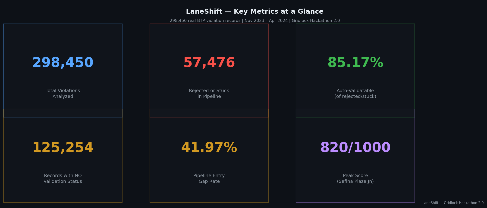

<div align="center">

# 🚦 LaneShift
### AI-Driven Parking Violation Intelligence for Bengaluru Traffic Police

[](https://github.com/deepakm0003/LaneShift)
[](https://github.com/deepakm0003/LaneShift)
[](https://github.com/deepakm0003/LaneShift)

> **LaneShift doesn't add more detection. It fixes what happens after detection.**

</div>

---

## 📊 The Problem

Bengaluru's existing camera system flags violations constantly — but most never reach a resolved outcome.

| Metric | Value |
|--------|-------|
| Total violations flagged (Nov 2023 – Apr 2024) | **298,450** |
| Records with NO validation status | **125,254 (42%)** |
| Rejected / stuck in pipeline | **57,476** |
| Never reach a resolved outcome | **61.23%** |
| Auto-recoverable by objective criteria | **85.17%** |
| Active detection devices (no new hardware needed) | **3,070** |

---

## 📈 Real Data Charts

<table>
  <tr>
    <td></td>
    <td></td>
  </tr>
  <tr>
    <td align="center"><b>Top Violation Types</b></td>
    <td align="center"><b>Validation Pipeline Funnel</b></td>
  </tr>
  <tr>
    <td></td>
    <td></td>
  </tr>
  <tr>
    <td align="center"><b>Violations by Hour (IST)</b></td>
    <td align="center"><b>Monthly Trend Nov 2023 – Apr 2024</b></td>
  </tr>
  <tr>
    <td></td>
    <td></td>
  </tr>
  <tr>
    <td align="center"><b>Top Junctions by Congestion Score</b></td>
    <td align="center"><b>Auto-Validation Recovery Potential</b></td>
  </tr>
  <tr>
    <td></td>
    <td></td>
  </tr>
  <tr>
    <td align="center"><b>Stations Congestion Score</b></td>
    <td align="center"><b>KPI Summary</b></td>
  </tr>
</table>

---

## 🧠 System Modules

### Module 1 — Detection-to-Decision Engine
- **YOLOv8n** (COCO pre-trained) runs on uploaded images and videos
- Videos sampled at **12 evenly-spaced frames** — best frame used for annotation
- **EasyOCR** reads number plates from detected vehicle regions
- Violation type inferred via spatial heuristics on bounding boxes
- Annotated output image returned with drawn boxes + plate labels

### Module 2 — Congestion-Cost Scoring Engine
- **0–1000 score** per violation
- Four weighted components:
  - Time of Day (35%) — peak hour multiplier from real IST data
  - Junction Density (30%) — 150K+ named-junction violations mapped
  - Violation Severity (25%) — 27 offence codes, severity 1–10
  - Stacking Multiplier (10%) — multi-violation records penalised

### Module 3 — Live Dispatch Priority Queue
- Junctions and mid-block zones ranked by aggregate congestion score
- Unified queue combining named junctions + mid-block clusters
- Per-station validation leak report (rejection rate by station)
- 5-minute cache, refreshable on demand

### Module 4 — Auto-Challan Record Generator
- Structured challan records for **48,955 auto-validatable violations**
- Criteria: single violation type · uncontested vehicle number · passed SCITA · severity < 9
- Records structured for BTP's existing SCITA/VAHAN pipeline
- Stops at vehicle registration number — no owner identity lookup

### Module 5 — Driver Nudge
- Nearest legal parking suggestion simulation
- Sampled from real dataset distribution

### Module 6 — Persistent Hotspot Escalation Engine
- Locations present in **≥85% of 23 weeks** → Tier 1 (Civic escalation)
- Locations present in **≥60% of weeks** → Tier 2 (Enforcement adjustment)
- Below 60% → Tier 3 (Standard monitoring)
- BTP051 Safina Plaza: violations in **all 23 weeks**, never below 147/week

---

## 🏗️ Architecture

```
┌─────────────────────────────────────────────────────────┐
│                    React Frontend (Vite)                  │
│  Landing · Live Dashboard · Detection · Hotspots ·        │
│  Challans · Monitor · Upload & Analyse                    │
└─────────────────────┬───────────────────────────────────┘
                      │ HTTP / WebSocket
┌─────────────────────▼───────────────────────────────────┐
│                  FastAPI Backend                          │
│  /api/detect     /api/dispatch    /api/challan           │
│  /api/hotspots   /api/forecast    /api/geo               │
│  /api/upload     /api/dashboard   /api/auto-validation   │
└──────┬──────────────────┬──────────────────┬────────────┘
       │                  │                  │
┌──────▼──────┐  ┌────────▼──────┐  ┌───────▼────────┐
│  YOLOv8n   │  │  SQLite DB    │  │   Scoring      │
│  EasyOCR   │  │  violations_  │  │   Engine       │
│  OpenCV    │  │  foundation   │  │   (M2)         │
└────────────┘  └───────────────┘  └────────────────┘
```

---

## 🔒 Data Integrity

The original **298,450-row** BTP dataset lives permanently in `violations_foundation` (SQLite).

- CSV uploads go to `violations_uploaded` (separate table, tagged with batch ID)
- **Foundation is never modified by uploads** — verified at every server startup
- `verify_foundation_integrity()` runs on boot and warns loudly if count changes

---

## 🚀 Setup

### Backend

```bash
# Install dependencies
pip install fastapi uvicorn ultralytics easyocr pandas sqlalchemy numpy opencv-python openpyxl

# Place the violations CSV in data/
# Server auto-loads it into violations_foundation on first startup

cd app
uvicorn main:app --reload --host 0.0.0.0 --port 8000

# After first startup, compute scores (run once, ~17 seconds)
curl -X POST http://localhost:8000/api/compute-scores
```

### Frontend

```bash
cd laneshift-frontend
npm install
npm run dev        # → http://localhost:5173
npm run build      # → dist/
```

---

## 📡 Key API Endpoints

| Method | Endpoint | Description |
|--------|----------|-------------|
| `GET` | `/api/dashboard/summary` | Full dashboard payload (single call) |
| `GET` | `/api/dispatch/live-queue` | Unified dispatch priority queue |
| `GET` | `/api/hotspots/persistent-escalation-report` | All 3 tiers of hotspot locations |
| `GET` | `/api/challan/preview` | 10 sample auto-challan records |
| `POST` | `/api/detect/simulate` | Upload image/video → YOLOv8 detection |
| `POST` | `/api/upload/csv` | Upload CSV → full analytics dashboard |
| `GET` | `/api/forecast/{station}` | 14-day forecast + backtest MAE/MAPE |
| `GET` | `/api/geo/violation-points` | GeoJSON for Mapbox map layer |
| `GET` | `/docs` | Interactive Swagger UI |

---

## 🛠️ Tech Stack

**Backend**
- Python 3.11, FastAPI, Uvicorn
- SQLAlchemy + SQLite
- YOLOv8n (ultralytics), EasyOCR, OpenCV
- pandas, numpy, scikit-learn

**Frontend**
- React 18 + TypeScript, Vite
- Framer Motion (animations)
- Mapbox GL JS (violation heatmap)
- React Router v6

---

<div align="center">

**Built for Gridlock Hackathon 2.0 · Flipkart × Bengaluru Traffic Police · Theme 1**

*298,450 real violations · Nov 2023 – Apr 2024 · No new hardware required*

</div>
